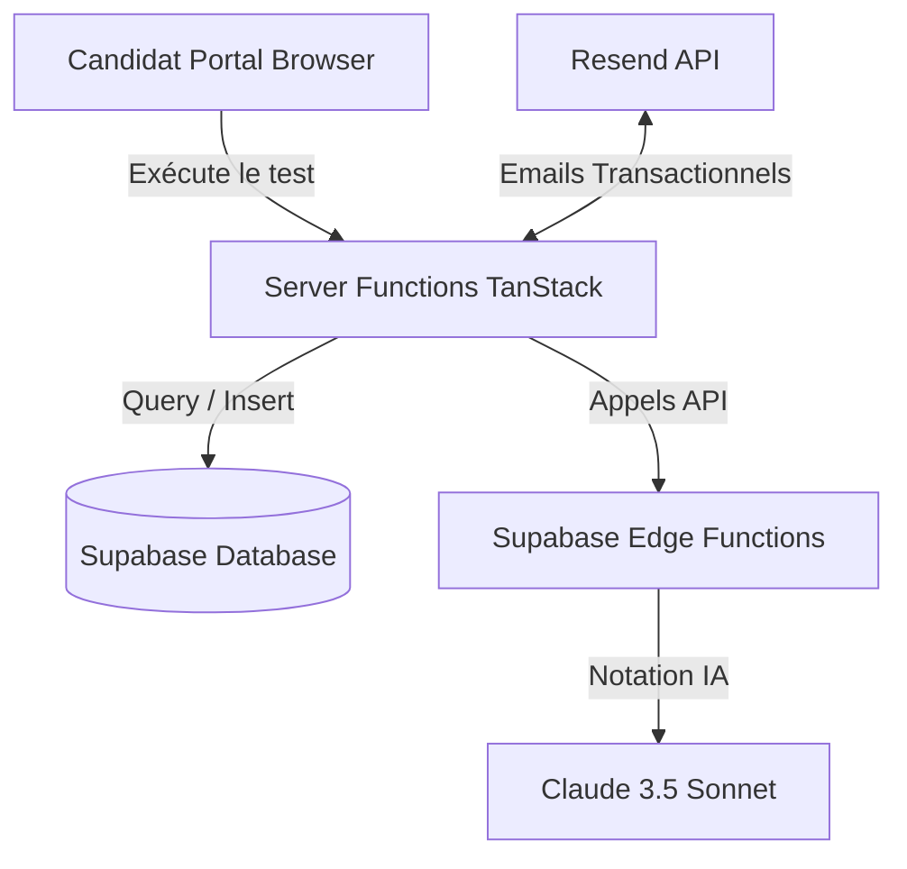

# Architecture — Bilan Français Formation

Ce document décrit l'architecture technique unifiée du projet **Bilan Français Formation** (le Portal) et ses interactions avec **Formateur Connect** (le Brain).

---

## 🛠️ Vue d'ensemble

Le projet est divisé en deux composants principaux :
1. **Le Portal** (`bilan-fran-ais-formation`) : Application frontend/SSR construite avec TanStack Start et Vite, gérant l'interface utilisateur, la capture de leads, et la présentation des offres de formation.
2. **Le Brain** (`formateur-connect`) : Logique métier centrale hébergée sur Supabase (Base de données PostgreSQL + Edge Functions), gérant le stockage des données, l'évaluation du niveau linguistique, et le scoring.

---

## 📦 Catalogue d'Offres Dynamique

Les offres de formation (pricing, durée, etc.) ne sont plus écrites en dur dans le frontend. Elles proviennent d'une table unique sur Supabase : `formation_offers`.

### Flux de Données Client
- Le hook `useFormationOffers` utilise `@tanstack/react-query` pour récupérer les offres depuis Supabase.
- En cas d'erreur de connexion ou de chargement, un fallback statique de secours de 5 parcours (`FALLBACK_JOURNEYS`) est utilisé pour garantir que le candidat puisse toujours voir les tarifs.

### Flux de Données Serveur (Emails)
- Pour la génération d'emails transactionnels, l'utilitaire `src/utils/formation-offers.server.ts` effectue une requête asynchrone directe à Supabase.
- Les emails envoyés par Resend (`email-bilan.ts` et `email-sequences.ts`) affichent ainsi toujours les mêmes tarifs dynamiques et exacts que le frontend.

---

## 🔐 Sécurisation de l'Admin

- L'accès à la console d'administration est sécurisé via le middleware TanStack Start.
- Le fichier `src/start.ts` intègre `attachSupabaseAuth` comme `functionMiddleware` global afin de propager le contexte d'authentification de l'utilisateur à toutes les fonctions serveur exécutées.

---

## 📋 Conformité RGPD

- **Désinscription** : Une route publique `/unsubscribe` a été ajoutée. Elle permet aux utilisateurs d'arrêter de recevoir des relances par email ou WhatsApp.
- Les emails transactionnels contiennent tous un lien de désinscription pointant vers cette route.
